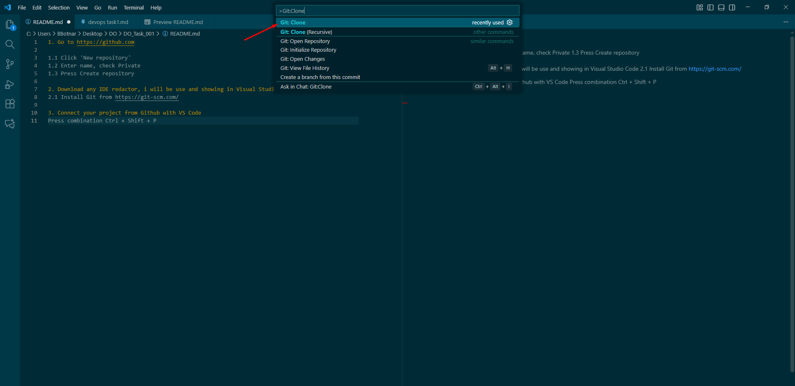

1. Go to https://github.com

1.1 Click 'New repository'
1.2 Enter name, check Private
1.3 Press Create repository

2. Download any IDE redactor, i will be use and showing in Visual Studio Code 
2.1 Install Git from https://git-scm.com/

3. Connect your project from Github with VS Code
Press combination Ctrl + Shift + P
Choose 'Git:Clone'
Select Clone from GitHub

Choose repository, Choose folder on your PC
Click Open repository
VS Code is now connected to GitHub

For verify, open terminal git: 'Ctrl + `'
Put 'git remote -v'
If you see like 'origin  https://github.com/<your-username>/DevOps-TaskName.git' - You connected

If error like 'fatal: not a git repository (or any of the parent directories): .git' - You should open your project from your Project Directory (File -> Open Folder -> Choose your folder for git)

4. Create `.gitignore` file.
.gitignore is a file that tells Git which files NOT to upload.

4.1 Creating '.gitignore' file:

In VS Code Explorer panel:
File -> New File

Name it exactly:
'.gitignore'

Add content to .gitignore

I use settings like this:

### VS Code settings
.vscode/

### Logs
*.log

## Temporary files
*.tmp
*.swp

5. Create new branch
Or just remain current branch 'main'

6. You will need a `UNIX-like OS`  for further tasks, so you (and i) have to install it.

The most commonly used OS is `Ubuntu 24.04`, but you can choose any other `UNIX-OS` 
I used ubuntu
6.1 go to https://www.virtualbox.org/wiki/Downloads
Download VirtualBox for Windows (if you youse Windows like me)
Click “Windows hosts” - install it

6.2 Download Ubuntu 24.04 ISO
Go here:
https://ubuntu.com/download/desktop , and download .iso file for virtual box

6.3 Create a new Virtual Machine in VirtualBox and configure it
My configuration:

